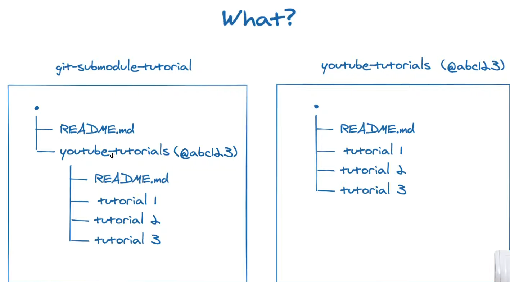
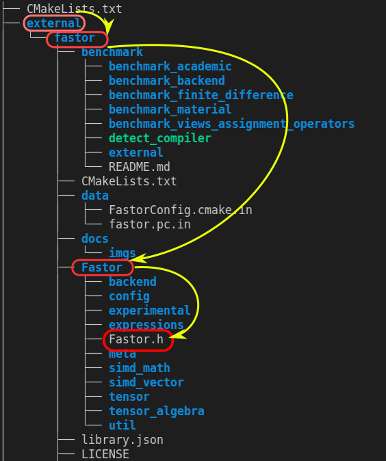

# Cmake and External Library

This practice is to show
- how to install and manage external libraries with git submodule
- how to integrate external libraries with git


## why git submodule
It is so often that our external libraries come from git repositories. Their verisons are always controllerd under git.

Let us say we want an external library to be **a part of our project**. 

For instance, we want to use the library youtube-tutorials in our main project git-submodule-turorial.



Here are some expectations from us
- Each person is in charge of his own work. We do not want to maintain others' codes. We just use it **without looking inside**.
- We can control our library version in spite of his update. They keep working and improving their codes by adding new feutures and fixing bugs. But, we may not need those updates at all. Even worse, those updates could break our codes if they changed some access. Thus, **we should be able to control the library version**.
- We only take our own credits. If someone finds our codes interesting and try to git clone, with submodule he can find the library and the version at the original address. **It means that credits go to the library developers and we do not steal them**.

## install and use an external libarary with git
### 1. download source code with git submodule
For example, there is a folder called as *external* that we create for external libraries. Now, we want to use a library **Fastor** that is a high performance tensor (fixed multi-dimensional array) library for modern C++.

```
-----root
| 
|--- CMakeLists.txt 
| 
|--- main.cpp
|
|--- function
|----|---- function1.cpp
|----|---- function1.hpp
|----|---- CMakeLists.txt
|
|--- external # external library
```

There is how we use git commands to add an external library.

We download the library codes into /external/fastor
```shell
cd root/external
git submodule add https://github.com/romeric/Fastor.git 
```

```
-----root
| 
|--- CMakeLists.txt 
| 
|--- main.cpp
|
|--- function
|----|---- function1.cpp
|----|---- function1.hpp
|----|---- CMakeLists.txt
|
|--- external_library
|----|---- fastor
```
### 2. build a library from source code
Obvisouly, what we download from github is just source codes. We need to build the library **Fastor** using its source code before we call use this library.

Let me remind you here. To call a library in our main fucntion requires three important information
1. A well built library,
2. Cmake can link our main executable to the library .a or .so,
3. Cmake locates the header files and use this relative location in the main.cpp.


The firs two requirement depend on how a library is designed to be built. For instance, our library **Fastor** is built using Cmake as well. We can find the CMakeLists.txt in the **external/fastor** folder.

Thus, we just have to add the fastor library to our CMakeLists tree by addings

```cmake
# add directory of external library
add_subdirectory(external/fastor) 
```

Because the **Fastor CMakeLists** builds the library automatically, we only need to tell our Cmake "hi, check this folder and you can find a CMakeLists.txt. Then do what it reads."

Then, run
```shell
    cd build
    cmake ..
    make
```

### 3. link an external library using CMakeLists and main.cpp
Now we give a shoot to address the second question:
-  Cmake can **link** our main executable to the library **.a** or **.so**

**NOTE**
It is so essential to check the library **Fastor CMakiLists** to see
- if it is built as a **library**
- what is the library **name** 

We are lucky to find in the **Fastor CMakiLists** that
```cmake
add_library(Fastor INTERFACE)
```
which means **Fastor** is built as a **library** named after **Fastor**.

Therefore, in the main CMakeLists.txt, we tell the Cmake to **link** the library

```cmake
target_link_libraries(out Fastor)
```
### 4. call an external library in main.cpp
Now we give a shoot to address the last questions:
-  Cmake finds the header files and use this relative location in the main.cpp

OK, now comes the most tricky part of this exercise. First of all, we library target does not include its location information as we did in the *3_CMake_Library*. 

As a consequence, we still know nothing of its location when we link the library to our main target using 
```cmake
target_link_libraries(out Fastor).
```

In order to allow our main executable file to find the library, we can manually add the library location information to our main target

```cmake
# locate hpp files of external library
target_include_directories(out PUBLIC external/fastor)
```

 

The full path of Fastor.h to main CMakeLists is **external/fastor/Fastor/Fastor.h**. 

As we define the include path in the CMakeLists as **external/fastor**, the relative path of *Fastor.h* w.r.t main.cpp is **Fastor/Fastor.h**
```cpp
#include "Fastor/Fastor.h"
```
Done!!! Now our main project should be able to run.


Hold on a little :)

Let us test our thoughts one more time.

Knowning the full path is **external/fastor/Fastor/Fastor.h**, if we define the include path in our main CMakeLists as
```cmake
target_include_directories(out PUBLIC external)
```

then, the relative path in our main.cpp must be
```cpp
#include "fastor/Fastor/Fastor.h"
```

# Source
1. GitKraken, *Git Tutorial: All About Submodules*, Youtube, [link](https://www.youtube.com/watch?v=8Z4Cmhji_FQ&ab_channel=GitKraken).
2. Code, Tech, and Tutorials, *CMake Tutorial EP 3 | Git Submodules (adding glfw windowing library example)*, Youtbe, [link](https://www.youtube.com/watch?v=ED-WUk440qc&list=PLalVdRk2RC6o5GHu618ARWh0VO0bFlif4&index=3&ab_channel=Code%2CTech%2CandTutorials).
