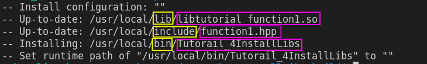
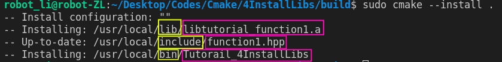
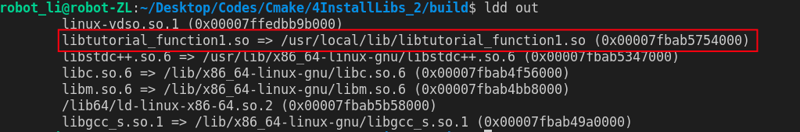

# CMake installs built libraries
This practice is to show
- what is install and why we need it
- how to write a CMakeListsto install a library after building it from source codes
- how to use installed libraries using CMakeLists

## Why we need "install"?
Everytime before learning something, we are encouraged to ask "why we need this". This is not only to activate the motiviation, but also to building our learning map where this new technique lays in the big picture.

Imagine, we want to build a bicycle at the beginning. 

A smart man never builds wheels. That is why we obtain others' wheels or codes from git. It is what we have done in *4_CMake_External_Library*. We download the codes in the source folder and build the library from the codes.

Now we have a new situation. The wheels we obtain are so great. More than one project find it interesting. We use the wheels for our project bike, however the prject car can still needs it. Will we redo the process download and build again?

No, it is completely waste of time. What we should do is to put the wheels in our "atelier" where all our projects can access. Moving the wheels to the atelier is the so-called **install**.

## Cmake install libararies 
**Install** is to put the wheels in our atelier for every project. In our case, we can use executables or libraries *everwhere* not just in the orginal source directory. In Linux systems, the atelier is often set to be */usr/local*.

Three things must be moved into the atelier:
1. wheels -- *executables*,
2. elements -- *libraries*,
3. element index -- *header files*.
   
Then, we are able to take and use the wheels by calling *executables*. We also can find the wheels of the wheels, *libraries* used in *executables* and index book, i.e. *header files*, for both *wheels* and *libraries*.

Cmake provides the following commands
- for *executables*
    ```cmake
    Install(TARGETS *executable* RUNTIME DESTINATION ${CMAKE_INSTALL_PREFIX}/bin)
    ```
- for *libraries*
  - static using ARCHIVE
    ```cmake
    Install(TARGETS *libraries* ARCHIVE DESTINATION ${CMAKE_INSTALL_PREFIX}/lib)
    ``` 
  - dynamic using LIBRARY
    ```cmake
    Install(TARGETS *libraries* LIBRARY DESTINATION ${CMAKE_INSTALL_PREFIX}/lib)
    ```   
- for *header files*
    ```cmake
    Install(FILES *header files* INCLUDE DESTINATION ${CMAKE_INSTALL_PREFIX}/include)
    ```  

Then, we build and install the wheels as
```shell
cmake ..

cmake --build .

sudo cmake --install .
```  
Building a dynamic library is like 


while building a static library is like 


**NOTE**
Dynamic libraries in Linux requries addiontal configuration. Linux onlys searchs dynamic libraries at certain paths. The searching path is defined by a variable **LD_LIBRARY_PATH**.

We can check the searching path by 
```shell
echo $LD_LIBRARY_PATH
``` 

If our **${CMAKE_INSTALL_PREFIX}/lib**, **/usr/local**, is not in the display, then Linux will not find our library during the running time. In order to fix this, we just need to add our install path to the *LD_LIBRARY_PATH*.

It can be done by adding one command in the *.bashrc*
```shell
LD_LIBRARY_PATH=$LD_LIBRARY_PATH:/usr/local/lib
``` 

In Linux, we can find a file/executable's location with the following command
```shell
sudo find / -name libtutorial_function1.so 
# search libtutorial_function1.so for example
```  
## Call installed library with CMakeLists
In our **main CMakeLists**:

1. searching for our package and define searching path for the PackNameConfig.cmake of the package
```cmake
SET(CMAKE_PREFIX_PATH "${CMAKE_INSTALL_PREFIX}/lib/cmake")
```
2. search the package (name we call libraries in CMake)
```cmake
find_package(tutorial_function1 REQUIRED)
```
3. we can check if we have found the library
```cmake
if(tutorial_function1_FOUND)
    message(STATUS "library tutorial_function1 is found")
    message(STATUS "installed library include directory is ${tutorial_function1_INCLUDE_DIRS}")
    message(STATUS "installed library library directory is ${tutorial_function1_LIBRARY_DIRS}") # this is usally not used
    message(STATUS "installed library is ${tutorial_function1_LIBRARIES}")
else()
    message(STATUS "library tutorial_function1 is NOT found")
endif()
```
4. link the library to our project
```
target_link_libraries(out tutorial_function1)
```




# Source
1. Code, Tech, and Tutorials, CMake Tutorial EP 6 | Installing Your Software! (part 1/2 of install), [link](https://www.youtube.com/watch?v=x7l31sbQDGk&list=PLalVdRk2RC6o5GHu618ARWh0VO0bFlif4&index=6&ab_channel=Code%2CTech%2CandTutorials).
2.  Juste Un Petit Cours, Cmake Installation, [link](https://www.youtube.com/watch?v=IuNdhR8-rGs&list=PLnLgSm1YaX18rzqCMd-AE8VEgz8j45MMD&index=10&ab_channel=JusteUnPetitCours).
3.  CMake, install, [link](https://cmake.org/cmake/help/v3.21/command/install.html#imported-runtime-artifacts).
4.  Juste Un Petit Cours, Cmake/Linux Installation Sans Droit Administrateur, [link](https://www.youtube.com/watch?v=JA0x6A8lkek&list=PLnLgSm1YaX18rzqCMd-AE8VEgz8j45MMD&index=11&ab_channel=JusteUnPetitCours).
5.  [link](https://gitlab.kitware.com/cmake/community/-/wikis/doc/tutorials/How-To-Find-Libraries)


